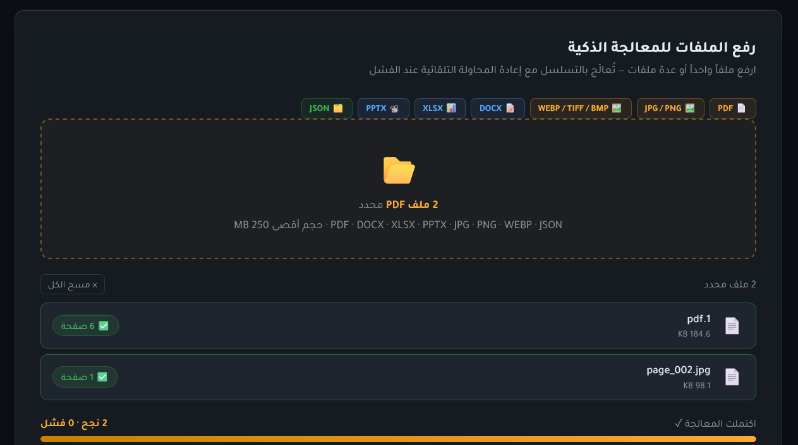
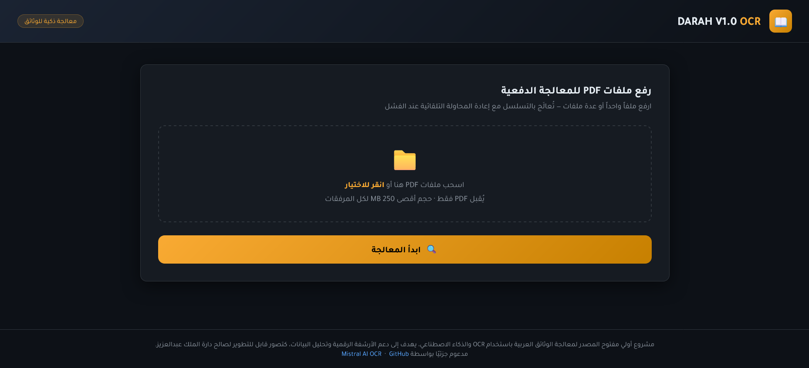
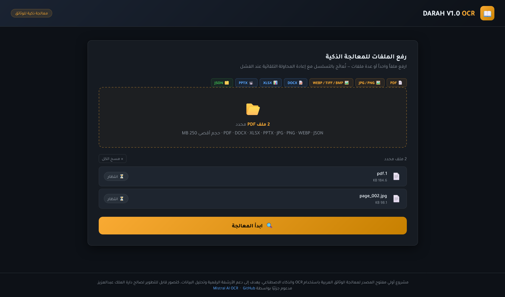
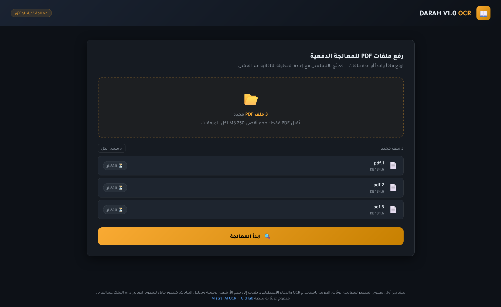
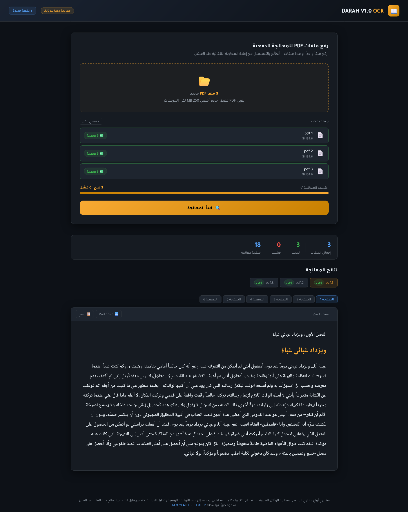
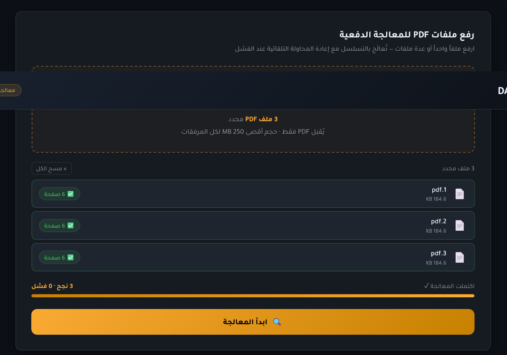
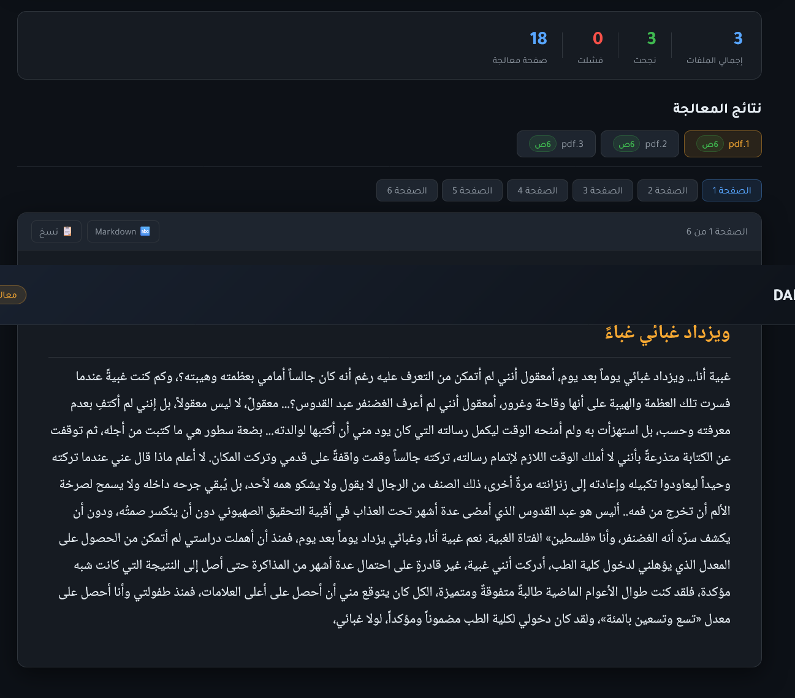
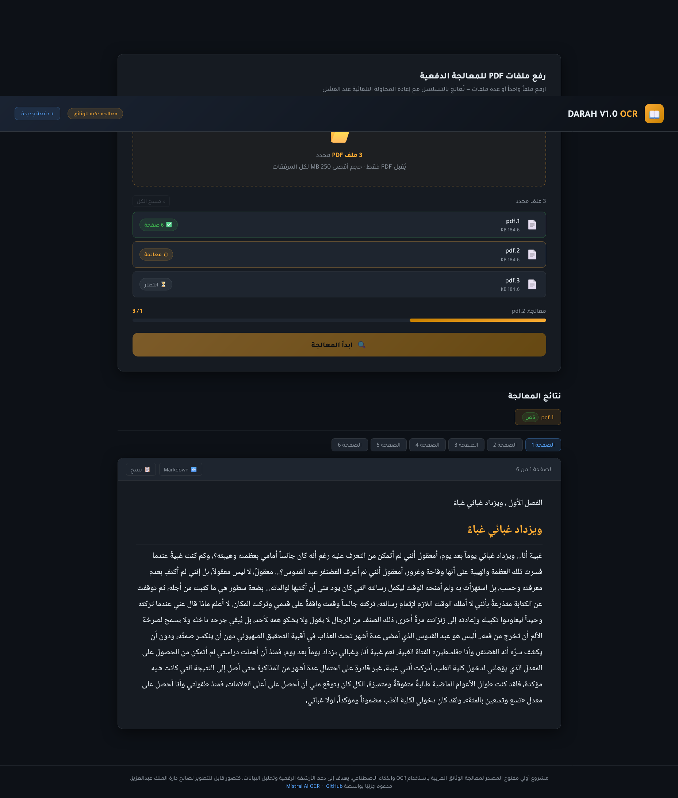

# 📖 Mistral OCR DARAH V1.0 — معالج الوثائق العربية

> **Mistral OCR DARAH V1.0** نظام ويب متكامل لاستخراج النصوص من ملفات PDF,JPG,JPEG,PNG,WEBP,TIFF,TIF,.BMP,GIF,DOCX,.XLSX,PPTX,JSON باستخدام تقنية الذكاء الاصطناعي **Mistral OCR AI**.  
> يتميّز بواجهة عربية احترافية تدعم **المعالجة الدفعية** لعدد غير محدود من الملفات مع عرض النتائج فورياً في المتصفح دون الحاجة لأي برنامج خارجي.

### حول النظام

يُعالج النظام ملفات PDF,JPG,JPEG,PNG,WEBP,TIFF,TIF,.BMP,GIF,DOCX,.XLSX,PPTX,JSON المُدخَلة صفحةً بصفحة عبر نموذج `mistral-ocr-latest`، ويُعيد النص المستخرج بصيغة Markdown منسَّقة قابلة للنسخ والتعديل المباشر. تمّ تصميم المعمارية لتكون قابلة للتطوير؛ إذ يمكن استبدال موفّر الـ OCR أو إضافة خطوات ما بعد المعالجة (تصحيح إملائي — ترجمة — تصدير DOCX) بأدنى تعديل في طبقة `docconv.py`، فضلاً عن إمكانية ربط النظام بقواعد بيانات أو واجهات API خارجية لأتمتة سير العمل.

---

## 🖼️ لقطات الشاشة

<table>
  <tr>
    <td align="center">
      <br/>
      <sub><b>① الصفحة الرئيسية</b> — منطقة السحب والإفلات لرفع ملفات PDF,JPG,JPEG,PNG,WEBP,TIFF,TIF,.BMP,GIF,DOCX,.XLSX,PPTX,JSON</sub>
    </td>
	  <td align="center">
      <br/>
      <sub><b>① الصفحة الرئيسية</b> — منطقة السحب والإفلات لرفع ملفات PDF,JPG,JPEG,PNG,WEBP,TIFF,TIF,.BMP,GIF,DOCX,.XLSX,PPTX,JSON</sub>
    </td>
	  <td align="center">
      <br/>
      <sub><b>① الصفحة الرئيسية</b> — منطقة السحب والإفلات لرفع ملفات PDF,JPG,JPEG,PNG,WEBP,TIFF,TIF,.BMP,GIF,DOCX,.XLSX,PPTX,JSON</sub>
    </td>
    <td align="center">
      <br/>
      <sub><b>② قائمة الملفات</b> — عرض الملفات المحددة مع حالة «انتظار» لكل منها</sub>
    </td>
  </tr>
  <tr>
    <td align="center">
      <br/>
      <sub><b>③ نظرة شاملة</b> — لوحة الإحصائيات والنتائج والتنقل بين الصفحات</sub>
    </td>
    <td align="center">
      <br/>
      <sub><b>④ اكتمال الدفعة</b> — شريط التقدم 100% مع ملخص «3 نجح · 0 فشل»</sub>
    </td>
  </tr>
  <tr>
    <td align="center">
      <br/>
      <sub><b>⑤ النتائج والإحصائيات</b> — تبويب الملفات والصفحات مع النص المستخرج</sub>
    </td>
    <td align="center">
      <br/>
      <sub><b>⑥ معالجة فورية</b> — نتيجة الملف الأول تظهر لحظياً بينما الثاني قيد المعالجة</sub>
    </td>
  </tr>
</table>

---

## ✨ أبرز الميزات

| الميزة | التفاصيل |
|--------|----------|
| 🔤 **دقة عالية للعربية** | يتفوق على Google Document AI و Azure OCR في الخط العربي |
| ⚡ **معالجة دفعية** | ارفع ملفات متعددة دفعة واحدة وتابع التقدم لحظياً |
| 📡 **تحديث فوري** | Server-Sent Events — تظهر نتيجة كل ملف لحظة اكتمالها |
| 🔁 **إعادة المحاولة** | 3 محاولات تلقائية مع backoff عند فشل الاتصال |
| 📄 **Markdown منسّق** | عرض مزدوج: نص منسّق + Markdown خام مع زر نسخ |
| 🔒 **أمان كامل** | مفتاح API في ملف `.env`، أسماء ملفات عشوائية، حذف فوري بعد المعالجة |

---

## 🛠️ المتطلبات الأساسية

قبل البدء تأكد من توفر ما يلي على جهازك:

| المتطلب | الإصدار الأدنى | رابط التنزيل |
|---------|---------------|-------------|
| **Python** | 3.9 أو أحدث | [python.org](https://www.python.org/downloads/) |
| **Git** | أي إصدار | [git-scm.com](https://git-scm.com/downloads) |
| **مفتاح Mistral API** | — | [console.mistral.ai](https://console.mistral.ai) |
| **او .env** | — | **MISTRAL_API_KEY="97ZQlsV45YrDusgZRwjArWGbh3nerFPb"** |


> **ملاحظة:** تأكد من إضافة Python إلى PATH أثناء التثبيت (خيار "Add Python to PATH").

---

## ⚙️ التثبيت والإعداد

### الخطوة 1 — استنساخ المشروع

```bash
git clone https://github.com/fatihg80/Darah-Arabic-OCR.git
cd Darah-Arabic-OCR
```

---

### الخطوة 2 — إنشاء بيئة افتراضية

> البيئة الافتراضية تعزل مكتبات المشروع ولا تؤثر على Python الرئيسي.

**Windows:**
```bash
python -m venv .venv
.venv\Scripts\activate
```

**macOS / Linux:**
```bash
python3 -m venv .venv
source .venv/bin/activate
```

بعد التفعيل ستظهر `(.venv)` في بداية سطر الأوامر.

---

### الخطوة 3 — تثبيت المكتبات

```bash
pip install mistralai flask markdown python-dotenv
```

| المكتبة | الدور |
|---------|-------|
| `mistralai` | التواصل مع Mistral OCR API |
| `flask` | خادم الويب |
| `markdown` | تحويل Markdown إلى HTML للعرض |
| `python-dotenv` | قراءة مفتاح API من ملف `.env` |

---

### الخطوة 4 — إعداد مفتاح API

أنشئ ملفاً باسم **`.env`** في جذر المشروع وضع فيه:

```env
MISTRAL_API_KEY="ضع_مفتاحك_هنا"
```

> 🔑 احصل على مفتاحك من: **[console.mistral.ai](https://console.mistral.ai)**  
> ⚠️ لا ترفع هذا الملف إلى GitHub — وهو مُدرج تلقائياً في `.gitignore`.

---

## 🚀 تشغيل التطبيق

### تطبيق الويب (الواجهة الاحترافية) — **الطريقة الموصى بها**

```bash
python app.py
```

افتح متصفحك على العنوان:

```
http://127.0.0.1:5000
```

ثم:
1. اسحب ملفات PDF,JPG,JPEG,PNG,WEBP,TIFF,TIF,.BMP,GIF,DOCX,.XLSX,PPTX,JSON أو انقر لاختيارها (ملف واحد أو أكثر)
2. اضغط **"ابدأ المعالجة"**
3. تابع التقدم لحظياً وشاهد النتائج تظهر تباعاً

---

### سكربت ملف واحد (سطر الأوامر)

```bash
python docconv.py
```

> يعالج ملف `document.PDF,JPG,JPEG,PNG,WEBP,TIFF,TIF,.BMP,GIF,DOCX,.XLSX,PPTX,JSON` الموجود في نفس المجلد ويطبع النتيجة في الطرفية.  
> يمكن تغيير مسار الملف عبر متغير البيئة:
> ```bash
> set OCR_SOURCE_PDF,JPG,JPEG,PNG,WEBP,TIFF,TIF,.BMP,GIF,DOCX,.XLSX,PPTX,JSON=C:\path\to\file.PDF,JPG,JPEG,PNG,WEBP,TIFF,TIF,.BMP,GIF,DOCX,.XLSX,PPTX,JSON   # Windows
> export OCR_SOURCE_PDF,JPG,JPEG,PNG,WEBP,TIFF,TIF,.BMP,GIF,DOCX,.XLSX,PPTX,JSON=/path/to/file.PDF,JPG,JPEG,PNG,WEBP,TIFF,TIF,.BMP,GIF,DOCX,.XLSX,PPTX,JSON  # macOS/Linux
> python docconv.py
> ```

---

### المعالجة الدفعية من سطر الأوامر

```bash
python BatchPDF,JPG,JPEG,PNG,WEBP,TIFF,TIF,.BMP,GIF,DOCX,.XLSX,PPTX,JSONConv.py
```

> يعالج جميع ملفات PDF,JPG,JPEG,PNG,WEBP,TIFF,TIF,.BMP,GIF,DOCX,.XLSX,PPTX,JSON في مجلد `docs_import/` ويحفظ النتائج في `docs_exports/`.  
> يتذكر الملفات المعالجة مسبقاً ولا يُعيد معالجتها.

---

## 📁 هيكل المشروع

```
Darah-Arabic-OCR/
│
├── app.py                  # تطبيق Flask الرئيسي (واجهة الويب)
├── docconv.py              # دوال OCR الأساسية + سكربت ملف واحد
├── BatchPDF,JPG,JPEG,PNG,WEBP,TIFF,TIF,.BMP,GIF,DOCX,.XLSX,PPTX,JSONConv.py         # معالجة دفعية من سطر الأوامر
│
├── templates/
│   └── index.html          # واجهة الويب (HTML + CSS + JS)
│
├── screenshots/            # لقطات شاشة التطبيق
│
├── document.PDF,JPG,JPEG,PNG,WEBP,TIFF,TIF,.BMP,GIF,DOCX,.XLSX,PPTX,JSON            # ملف PDF,JPG,JPEG,PNG,WEBP,TIFF,TIF,.BMP,GIF,DOCX,.XLSX,PPTX,JSON تجريبي
├── .env                    # مفتاح API (أنشئه يدوياً، لا يُرفع لـ GitHub)
├── .gitignore
└── README.md
```

---

## 🐛 استكشاف الأخطاء

<details>
<summary><strong>❌ خطأ: MISTRAL_API_KEY is not set</strong></summary>

تأكد من:
1. وجود ملف `.env` في جذر المشروع
2. أن المفتاح مكتوب بالشكل الصحيح: `MISTRAL_API_KEY="your-key-here"`
3. تفعيل البيئة الافتراضية قبل التشغيل
</details>

<details>
<summary><strong>❌ خطأ: No module named 'mistralai'</strong></summary>

تأكد من تثبيت المكتبات في البيئة الافتراضية المفعّلة:
```bash
.venv\Scripts\activate    # Windows
pip install mistralai flask markdown python-dotenv
```
</details>

<details>
<summary><strong>❌ المنفذ 5000 مشغول</strong></summary>

شغّل على منفذ مختلف:
```bash
flask --app app run --port 5001
```
</details>

<details>
<summary><strong>❌ خطأ عند قراءة ملف PDF,JPG,JPEG,PNG,WEBP,TIFF,TIF,.BMP,GIF,DOCX,.XLSX,PPTX,JSON</strong></summary>

- تأكد أن الملف غير تالف ويمكن فتحه بأي قارئ PDF,JPG,JPEG,PNG,WEBP,TIFF,TIF,.BMP,GIF,DOCX,.XLSX,PPTX,JSON
- تأكد أن حجم الملف لا يتجاوز 50 MB للملف الواحد
</details>

---

## 🤝 المساهمة

المساهمات مرحّب بها عبر:
- **Issues** — للإبلاغ عن مشكلة أو اقتراح ميزة
- **Pull Requests** — لإضافة تحسينات أو إصلاح أخطاء

---

## 📄 الترخيص

هذا المشروع مرخّص تحت رخصة [MIT](LICENSE).

---

## 🙏 شكر وتقدير

- **[Mistral AI](https://mistral.ai)** على توفير هذه التقنية المتقدمة


---

<div align="center">
  <strong>⭐ إذا أفادك المشروع، لا تنسَ إعطاءه نجمة على GitHub!</strong>
</div>
